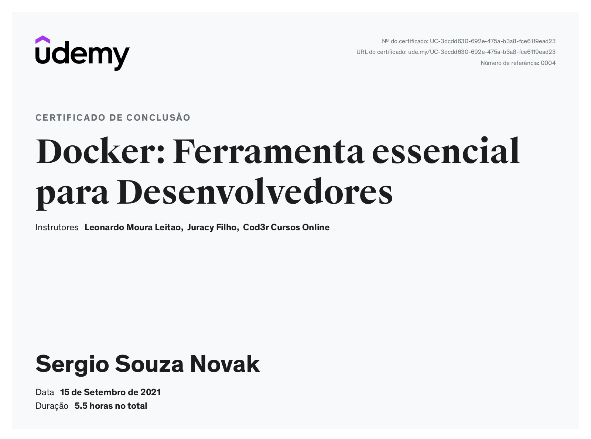

# Repositório do curso [Docker: Ferramenta essencial para Desenvolvedores](https://www.udemy.com/course/curso-docker/)

Esse repositório contém os scripts do docker do curso [Docker: Ferramenta essencial para Desenvolvedores](https://www.udemy.com/course/curso-docker/) do professor Leonardo Leittão.

