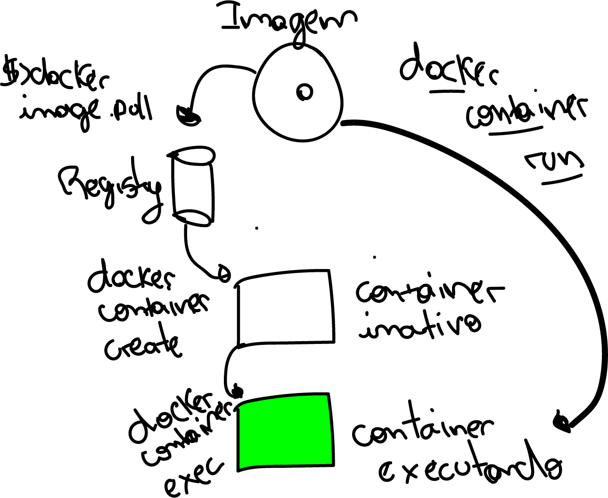

<h1> Primeiro script docker</h1>

Nesse script o docker cria um container chamado de helloWorld a partir de uma imagem, se a imagem existir ele usa, senão baixa do dockerhub.

o comando 

````powershell
docker container run hello-world
````

````powershell
Hello from Docker!
This message shows that your installation appears to be working correctly.    

To generate this message, Docker took the following steps:
 1. The Docker client contacted the Docker daemon.
 2. The Docker daemon pulled the "hello-world" image from the Docker Hub.     
    (amd64)
 3. The Docker daemon created a new container from that image which runs the  
    executable that produces the output you are currently reading.
 4. The Docker daemon streamed that output to the Docker client, which sent it
    to your terminal.

To try something more ambitious, you can run an Ubuntu container with:
 $ docker run -it ubuntu bash

Share images, automate workflows, and more with a free Docker ID:
 https://hub.docker.com/

For more examples and ideas, visit:
 https://docs.docker.com/get-started/

````


Esse comando faz o ``docker image pull`` para baixar uma imagem do registry do docker (aqui no caso é um registry do dockerhub pois não há um registry local), depois é feito o ``docker container create`` criando o container,  depois faz o ``docker container start`` a inicialização do container e por fim faz o ``docker container exec`` para executar o container.




A partir da versão 1.13 do docker houve uma mudança nos comandos, muitos comandos antigos funcionam. 