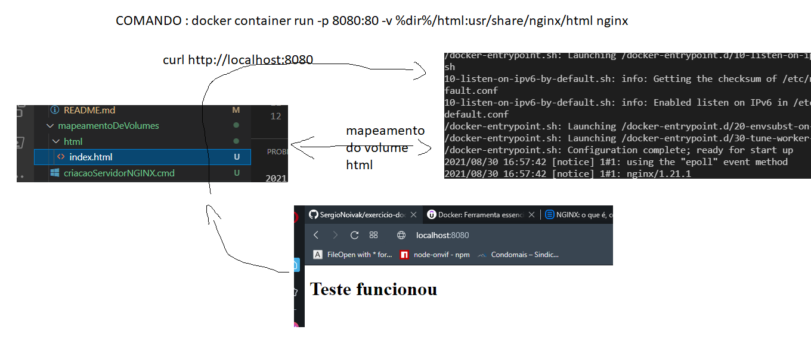

# Mapeamento de volumes


​    Para trocar arquivos entre a máquina host e o container é necessário fazer compartilhamento de volumes. para compartilhar arquivos da máquina host para o container usa-se o argumento ``-v`` que indica qual volume será mapeado.

Exemplo:

`````powershell
docker container run -p 8080:80 -v %cd%/html:/usr/share/nginx/html nginx

`````

Vai mapear no windows a pasta html do host para a pasta do servidor que busca o arquivo ``index.html`` no container.



Nessa prática, a pasta html no diretório atual da máquina host só pode mapear arquivos para o container nginx graças ao comando ``docker container run -p 8080:80 -v %dir%/html:/usr/share/nginx/html nginx``. Primeiro foi dito o mapeamento de portas e depois foi feito o mapeamento dos volumes, no primeiro lado dos : está o diretório do host e depois do outro lado está o diretório do container.

