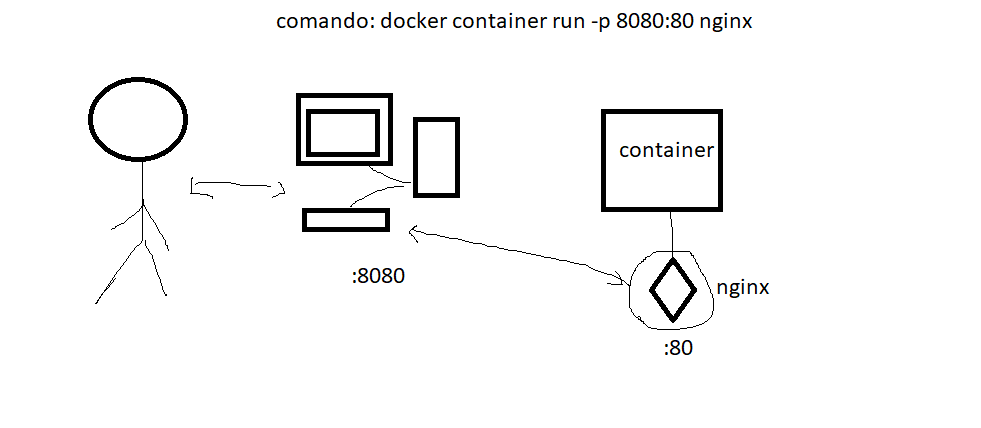

# Mapeando o servidor NGINX

Ao estar trabalhando em um projeto muitas vezes se faz necessário ligar um servidor. Para testar o site hospedado em um servidor em um container é necessário fazer o mapeamento da porta do container para a porta do computador host.

o comando ``docker container run -p 8080:80 nginx`` cria e starta um container do servidor nginx para um container do docker, no computador local dá para acessar a porta 8080, o que no interior do container siginifica a porta 80, ou seja, ocorre o mapeamento de portas.

